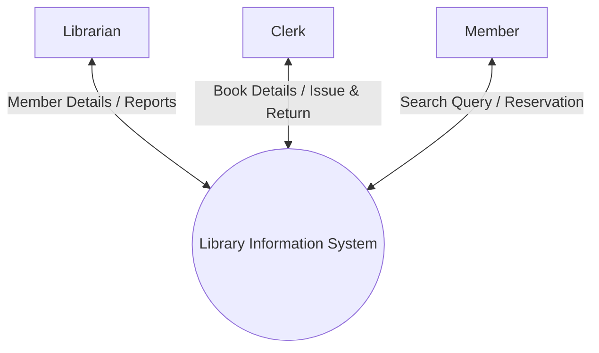
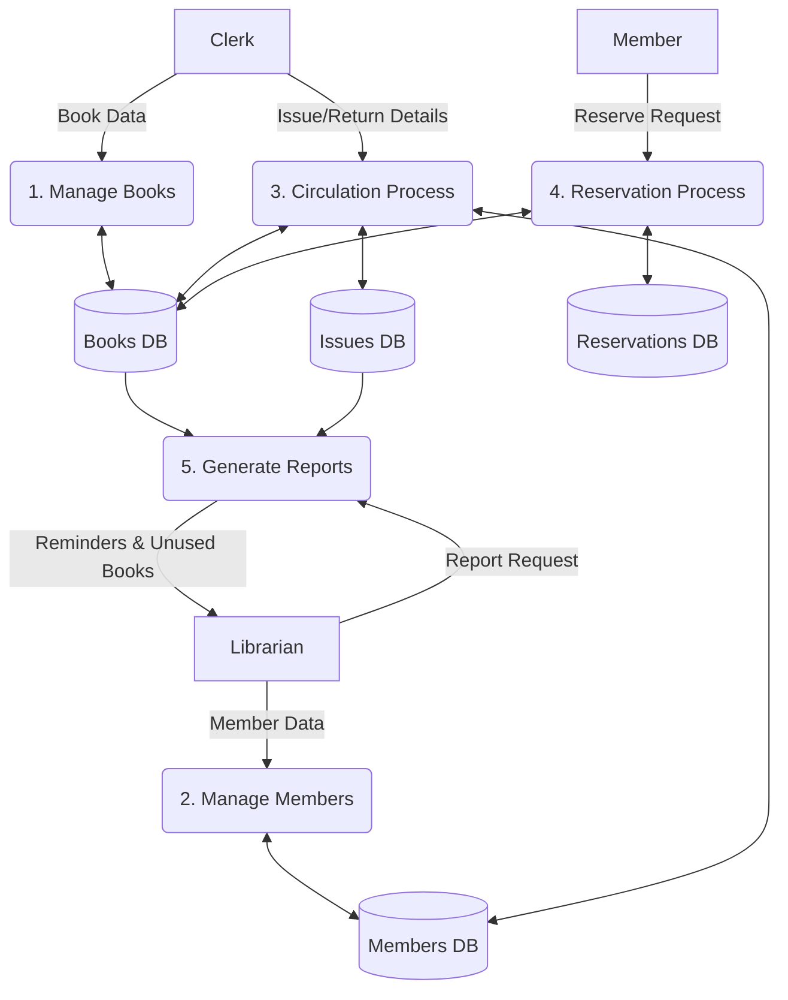
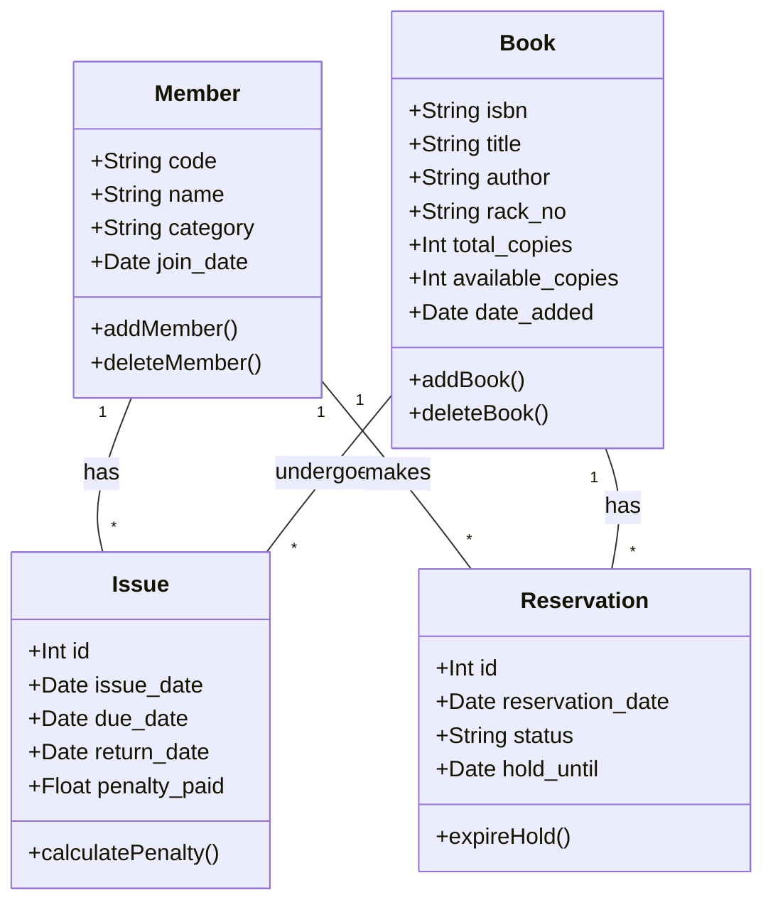
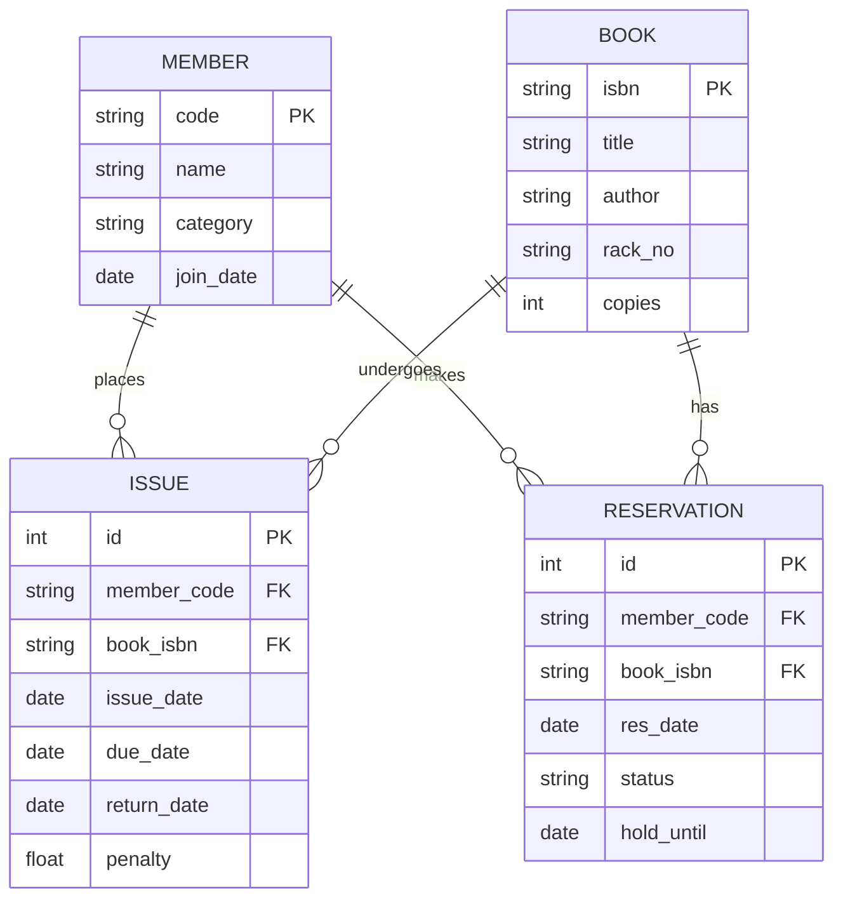
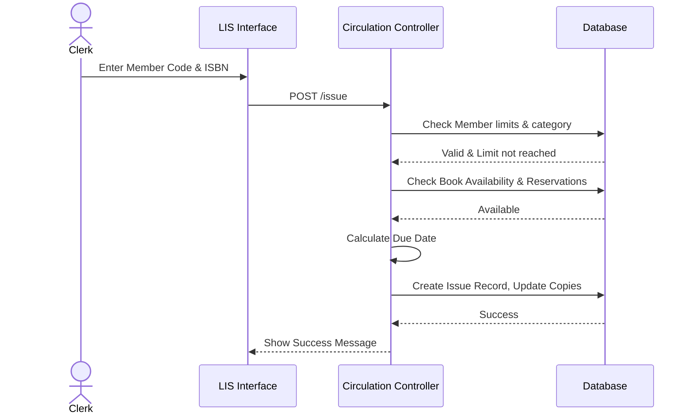
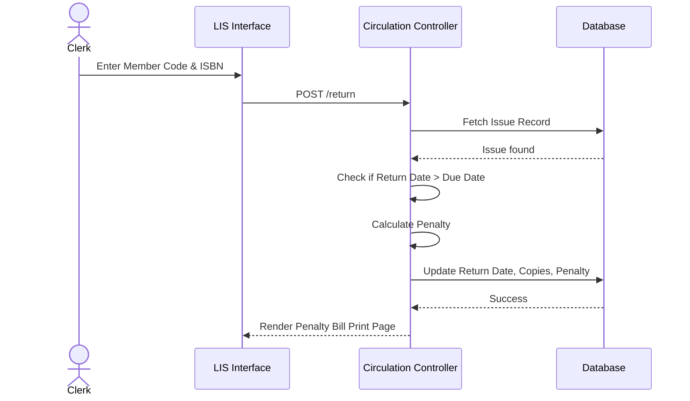
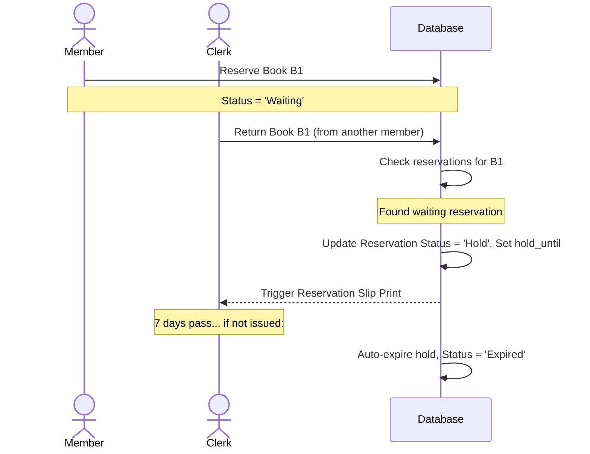
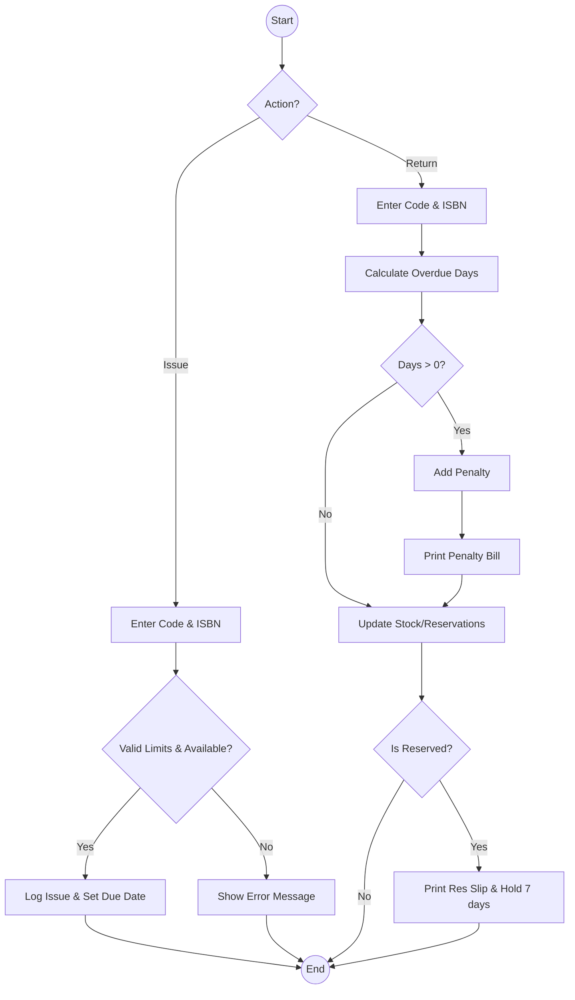

# Library Information System (LIS) - Software Engineering Documentation

## 1. Software Requirements Specification (SRS)

**1.1 Introduction**
The Library Information System (LIS) is an automated system intended to manage the book inventory, member records, and book circulation (issue, return, and reservation) for an institute's library. It replaces manual ledger-based processes with an efficient, reliable software solution.

**1.2 Scope**
LIS will track up to 10,000 books and manage four categories of members: Undergraduate (UG), Postgraduate (PG), Research Scholar (RS), and Faculty (FA). It handles book cataloging, issue/return transactions, automated penalty calculation for late returns, book reservations, and reporting (reminders and unused books).

**1.3 Assumptions & Constraints**
*   **Assumption 1**: Penalty rate is fixed globally (e.g., Rs. 2 per overdue day).
*   **Assumption 2**: "Not issued even once in the last 5 years" means no record of the book exists in the Issue log within the past 5 years from the current date.
*   **Assumption 3**: Reservations function as a FIFO queue. When a reserved book is returned, it is placed on a 7-day hold for the next member in the queue.
*   **Constraint 1**: The system uses a centralized SQLite database.
*   **Constraint 2**: Maximum capacity is 10,000 books.

**1.4 Functional Requirements**
*   **FR1**: The Clerk shall be able to add, update, and delete book details (ISBN, Title, Author, Rack No, Copies).
*   **FR2**: The Librarian shall be able to register and remove library members.
*   **FR3**: The system shall enforce issue limits based on member category (UG: 2 books/1 mo, PG: 4 books/1 mo, RS: 6 books/3 mo, FA: 10 books/6 mo).
*   **FR4**: The system shall calculate penalties for overdue books upon return.
*   **FR5**: The system shall allow members to reserve currently unavailable books and block issuance to others for 7 days upon return.
*   **FR6**: The Librarian can generate overdue reminders and an unused books report.

**1.5 Non-Functional Requirements**
*   **NFR1**: The system must have a simple, clean, and intuitive UI (Bootstrap 5).
*   **NFR2**: The database must prevent SQL injection attacks.
*   **NFR3**: Print functionality must be supported for bills, slips, and reminders.

---

## 2. Use Case Diagram

```mermaid
usecaseDiagram
    actor Librarian
    actor Clerk
    actor Member

    usecase "Manage Members" as UC1
    usecase "Generate Reports" as UC2
    usecase "Manage Books" as UC3
    usecase "Issue Book" as UC4
    usecase "Return Book" as UC5
    usecase "Search Book" as UC6
    usecase "Reserve Book" as UC7

    Librarian --> UC1
    Librarian --> UC2

    Clerk --> UC3
    Clerk --> UC4
    Clerk --> UC5
    Clerk --> UC6

    Member --> UC6
    Member --> UC7
```

**Use Case Descriptions:**
*   **Issue Book**: Clerk enters Member Code and ISBN. System checks member limits, book availability, and reservation locks. If valid, logs the issue and calculates due date.
*   **Return Book**: Clerk enters Member Code and ISBN. System calculates penalty (if any), prints a penalty bill (if overdue), updates available copies, and prints a reservation slip if the book was reserved by someone else.

---

## 3. Data Flow Diagrams (DFD)

### Level 0 DFD (Context Diagram)



### Level 1 DFD



---

## 4. Class Diagram



---

## 5. ER Diagram



---

## 6. Sequence Diagrams

### 6.1 Issue Book



### 6.2 Return Book with Penalty



### 6.3 Reserve & Return of Reserved Book



---

## 7. Activity Diagram (Issue/Return Process)



---

## 8. Test Plan

| ID | Description | Input | Expected Output | Status |
|---|---|---|---|---|
| TC01 | Clerk adds new book | Valid book details | Book added to DB successfully | Pass |
| TC02 | Clerk adds duplicate book | Existing ISBN | Error: "Book with this ISBN already exists" | Pass |
| TC03 | Librarian adds new member | Valid member details | Member added to DB successfully | Pass |
| TC04 | Issue book to UG member | UG Code, Available ISBN | Issued, Due date = +30 days | Pass |
| TC05 | Issue book to FA member | FA Code, Available ISBN | Issued, Due date = +180 days | Pass |
| TC06 | UG member exceeds limit | UG Code (already has 2 books) | Error: "Member has reached issue limit" | Pass |
| TC07 | Issue unavailable book | ISBN with 0 available | Error: "No copies available" | Pass |
| TC08 | Return on-time book | Valid Code & ISBN | Returned, no penalty | Pass |
| TC09 | Return overdue book (5 days) | Valid Code & ISBN | Returned, penalty bill Rs. 10 generated | Pass |
| TC10 | Reserve unavailable book | Member Code, ISBN | Reservation placed successfully | Pass |
| TC11 | Reserve available book | Member Code, ISBN | Message: "Book is currently available" | Pass |
| TC12 | Return reserved book | ISBN (reserved by M2) | Returned, Reservation slip for M2 generated | Pass |
| TC13 | Issue reserved book to M3 | M3 Code, ISBN | Error: "Book is reserved by another member" | Pass |
| TC14 | Overdue Reminders | Click Reminders button | Print page lists all overdue members | Pass |
| TC15 | Unused books report | Click Unused Books | Lists books not in Issue DB for last 5 yrs | Pass |

---

## 9. Project Report Outline

1.  **Abstract**: Brief summary of the LIS project, technologies used, and the problems it solves (manual tracking, automated penalties, reservations).
2.  **Introduction**: Project background, scope, and objectives.
3.  **Technologies Used**: Python, Flask, SQLite, Bootstrap 5, HTML/CSS.
4.  **System Design & Architecture**: Details of the SRS, DFDs, ER Diagram, and Class architecture.
5.  **Implementation Details**: Explanation of the core algorithms (e.g., penalty calculation, reservation hold expiry).
6.  **Testing**: Summary of unit testing and manual testing based on the Test Plan.
7.  **Conclusion**: Summary of achievements.
8.  **Future Scope**: Potential enhancements (e.g., email notifications, barcode scanning integration, online payment gateway for penalties).
